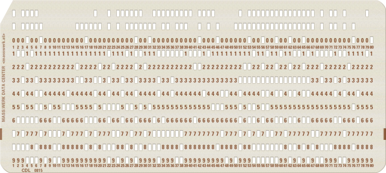

See Figure 12 page 62 of [Disk Monitor v1 Reference](http://media.ibm1130.org/1130-055-ocr.pdf) for what kind of cards are to be loaded.
See [this](https://www.ibm1130.net/functional/index.html) on how to read cards and the restriction on the loader card.

The restrictions on the loader card:
1. short instructions only
2. all displacements in instructions are relative to Instruction Address except for Shift, BOSC and BSC instructions.

```txt

Loader card 0 in format A:              op      ss displ 
           rows on card                 cell in core
            11    ______                     000==111111
            210123456789   dat   addr   0123456789012345
column 0: 0b110000000110 0xC06 0x0000 0b11000___00000110  LD_s  IA+6        # load constant 1 into the accumulator
       1: 0b000100001010 0x10A 0x0001 0b00010___00001010  SLA_s 10          # shift it left 10 bit places
       2: 0b110101111110 0xD7E 0x0002 0b11010___11111110  STO_s IA-2        # store it as constant 0x0200 (0b0000001000000000)
       3: 0b111010001011 0xE8B 0x0003 0b11101___00001011  OR_s  IA+11       # or it with the BOSC_s instruction at address 0x000F, turning it into BOSC_l
       4: 0b110100001001 0xD09 0x0004 0b11010___00001001  STO_s IA+9        # store it back
       5: 0b110001111011 0xC7B 0x0005 0b11000___11111011  LD_s  IA-5        # load constant 0x0200
       6: 0b011000110100 0x634 0x0006 0b01100___00110100  LDX_s IA = 0x34   # jump to further fixups 
       7: 0b000000000001 0x001 0x0007 0b00000___00000001  constant 1
       8: 0b000000010100 0x014 0x0008 0b00000___00010100  0x14 # Interrupt vector (lvl 0) for 1442 Card Read Punch (column read, punch), we want the column read        
       9: 0b000000001111 0x00F 0x0009 0b00000___00001111  0x0F #                   lvl 1
      10: 0b000000001111 0x00F 0x000A 0b00000___00001111  0x0F #                   lvl 2
      11: 0b000000001111 0x010 0x000B 0b00000___00001111  0x0F #                   lvl 3
      12: 0b000000110100 0x034 0x000C 0b00000___00110100  0x34 # Interrupt vector (lvl 4) for 1442 (operation complete), that is card completely read
      13: 0b000000001111 0x010 0x000D 0b00000___00001111  0x0F #                   lvl 5
      14: 0b010011000000 0x4C0 0x000E 0b01001___11000000  BOSC_l            # needs fixup!
      15: 0b010001000000 0x440 0x000F 0b01000___11000000                    # 'L' gets replaced by any unwanted interrupt 'calling' it
      16: 0b011000001110 0x60E 0x0010 0b01100___00001110  LDX_s IA = 0x0E   # jump back two cells
      17: 0b010000001000 0x408 0x0011 0b01000___00001000                    # 'O' gets replaced by saved accumulator
      18: 0b110001111110 0xC7E 0x0012 0b11000___11111110  LD_s  IA-2        # restore accumulator       
      19: 0b010011000000 0x4C0 0x0013 0b01001___11000000  BOSC_l            # needs fixup!
      20: 0b000000010010 0x012 0x0014 0b00000___00000000  0x0012            # gets replaced with saved IA during interrupt, set here by default to looping
      21: 0b110101111011 0xD7B 0x0015 0b11010___11111011  ST0_s IA-5        # temp save accumulator
      22: 0b000010010110 0x096 0x0016 0b00001___00010110  XIO_s IA+0x16     # do a Read XIO  ( 0x2E - 0x18 = 0x16 )
      23: 0b110000010101 0xC15 0x0017 0b11000___00010101  LD_s  IA+0x15     # load the address part of the Read IOCC into the accumulator
      24: 0b100001101000 0x868 0x0018 0b10000___11101000  ADD_s IA-18       # incr it by one
      25: 0b110100010011 0xD13 0x0019 0b11010___00010011  STO_s IA+0x13     # store it back
      26: 0b110000100100 0xC14 0x001A 0b11000___00010100  LD_s  IA+0x14     # load the state variable
      27: 0b111111101011 0xFEB 0x001B 0b11111___11101011  XOR_s IA-21       # xor it with one        ( 0d21 = 0d16 + 0d05 = 0x15 )
      28: 0b110100010010 0xD12 0x001C 0b11010___00010010  STO_s IA+0x12     # store it back
      29: 0b010010000100 0x484 0x001D 0b01001___00000100  SKAEV             # SKip if Accumulator is EVen
      30: 0b011000010010 0x612 0x001E 0b01100___00010010  LDX_s IA = 0x12   # go and return from the interrupt
      31: 0b110000001110 0xC0E 0x001F 0b11000___00001110  LD_s  IA+14       # load the address part of the Read IOCC into the accumulator
      32: 0b100101100111 0x967 0x0020 0b10010___11100111  MINUS_s IA-26     # subtract one from it ( 0d26 = 0d16 + 0d09 = 0x19 )
      33: 0b110100001100 0xD0C 0x0021 0b11010___00001100  STO_s IA+12       # store it back
      34: 0b110100000100 0xD04 0x0022 0b11010___00000100  STO_s IA+4        # store it as the target address of LD_l downrange
      35: 0b100101100100 0x964 0x0023 0b10010___11100100  MINUS_s IA-29     # subtract one again from it ( 0d29 = 0d16 + 0d12 = 0x1C )
      36: 0b110100000101 0xD05 0x0024 0b11010___00000101  STO_s IA+5        # store it as the target address of OR_l downrange
      37: 0b110100000111 0xD07 0x0025 0b11010___00000110  STO_s IA+7        # store it as the target address of STO_l downrange
      38: 0b110000000000 0xC00 0x0026 0b11000___00000000  LD_l              # needs fixup!  load B
      39: 0b100100000000 0x900 0x0027 0b10010___00000000                    # 'A' gets replaced
      40: 0b000110001000 0x188 0x0028 0b00011___00001000  SRL_s 8           # shift B right 8 bit places
      41: 0b111110000000 0xF80 0x0029 0b11111___00000000  XOR_l             # needs fixup!  or B with A
      42: 0b100000100000 0x820 0x002A 0b10000___00100000                    # 'D' gets replaced
      43: 0b110100000000 0xD00 0x002B 0b11010___00000000  STO_l             # needs fixup!  overwrite A with the result
      44: 0b100000010000 0x810 0x002C 0b01100___00100000                    # 'E' gets replaced
      45: 0b011000010011 0x612 0x002D 0b01100___00010010  LDX_s IA = 0x12   # return from interrupt
      46: 0b000000110101 0x034 0x002E 0b00000___00110100  0x0034            #                                Read IOCC1
      47: 0b000000100001 0x021 0x002F 0b00000___00100001  0x0021            # needs fixup via <<_9 !         Read IOCC2
      48: 0b000000000000 0x000 0x0030 0b00000___00000000  0x0000            # the state variable
      49: 0b010000000001 0x401 0x0031 0b01000___00000001                    # 'R' gets replaced by saved accumulator
      50: 0b110001111110 0xC7E 0x0032 0b11000___11111110  LD_s  IA-2        # restore accumulator
      51: 0b010011000000 0x4C0 0x0033 0b01001___11000000  BOSC_l            # needs fixup!
      52: 0b111011011100 0xEDC 0x0034 0b11101___11011100  OR_s  IA-34       # or it with the BOSC_s instruction at address 0x0013, turning it into BOSC_l
      53: 0b110101011011 0xD5B 0x0035 0b11010___11011011  STO_s IA-35       # store it back                                       # gets replaced by loader card 1
      54: 0b110001000111 0xC47 0x0036 0b11000___11000111  LD_s  IA-0x36     # load constant 0x0200  ( 0x37 - 0x01 = 0x36 )        # gets replaced by loader card 1
      55: 0b111011111011 0xEFB 0x0037 0b11101___11111011  OR_s  IA-5        # or it with the BOSC_s instruction at address 0x0033 # gets replaced by loader card 1
      56: 0b110101110111 0xD77 0x0038 0b11010___11110111  STO_s IA-6        # store it back                                       # gets replaced by loader card 1
      57: 0b110001000111 0xC47 0x0039 0b11000___11000111  LD_s  IA-0x39     # load constant 0x0200                                # gets replaced by loader card 1
      58: 0b111011101011 0xEEB 0x003A 0b11101___11101011  OR_s  IA-21       # or it with LD_s at 0x0026 (0d21 = 0d16+0d05 = 0x15) # gets replaced by loader card 1
      59: 0b110101101010 0xD6A 0x003B 0b11010___11101010  STO_s IA-22       # store it back                                       # gets replaced by loader card 1
      60: 0b110001000100 0xC44 0x003C 0b11000___11000100  LD_s  IA-0x3C     # load constant 0x0200                                # gets replaced by loader card 1
      61: 0b111011101011 0xEEB 0x003D 0b11101___11101011  OR_s  IA-0x15     # or it with the XOR_s at 0x0029 ( 0x3F - 0x2A = 0x15)# gets replaced by loader card 1
      62: 0b110101101010 0xD6A 0x003E 0b11010___11101010  STO_s IA-0x16     # store it back                                       # gets replaced by loader card 1
      63: 0b110101000001 0xD41 0x003F 0b11000___11000001  LD_s  IA-0x3F     # load constant 0x0200  ( tæpt! -Zarutian )           # gets replaced by loader card 1
      64: 0b111011101010 0xEEA 0x0040 0b11101___11101010  OR_s  IA-0x16     # or it with the STO_s at 0x02B ( 0x42 - 0x2C = 0x16) # gets replaced by loader card 1
      65: 0b110101101001 0xD69 0x0041 0b11010___11101001  STO_s IA-0x17     # store it back                                       # gets replaced by loader card 1
      66: 0b110000000110 0xC06 0x0042 0b11000___00000110  LD_s  IA+6        # load Control Start Read IOCC2                       # gets replaced by loader card 1
      67: 0b000100000101 0x105 0x0043 0b00010___00000101  SLA_s 5           # shift it left 5 bit places                          # gets replaced by loader card 1
      68: 0b110111000011 0xDC3 0x0044 0b11101___11000011  OR_s  IA-0x3D     # or it with constant 1 ( 0x44 - 0x07 = 0x3D )        # gets replaced by loader card 1
      69: 0b000100000010 0x102 0x0045 0b00010___00000010  SLA_s 2           # shift it left 2 bit places                          # gets replaced by loader card 1
      70: 0b110100000010 0xD02 0x0046 0b11010___00000010  STO_s IA+2        # store it back                                       # gets replaced by loader card 1
      71: 0b110001101000 0xC68 0x0047 0b11000___11101000  LD_s  IA-0x18     # load from 0x002F ( 0x47 - 0x2F = 0x40 - 0x29 = 0x20 - 0x09 = 0x18 )
      72: 0b000100001001 0x109 0x0048 0b00010___00001001  SLA_s 9           # shift it left 9 bit places                          # gets replaced by loader card 1
      73: 0b110101100101 0xD65 0x0049 0b11010___11100101  STO_s IA-0x1B     # store it back                                       # gets replaced by loader card 1
      74: 0b000010000000 0x080 0x004A 0b00001___00000000  XIO_s IA+0        # do XIO Control Start Read IOCC2                     # gets replaced by loader card 1
      75: 0b011000010010 0x612 0x004B 0b01100___00010010  LDX_s IA = 12     # try to return from an never happened interrupt      # gets replaced by loader card 1
      76: 0b000000101000 0x028 0x004C 0b00000___00101000                    #                                                     # gets replaced by loader card 1
      77: 0b000000000000 0x000 0x004D 0b00000___00000000                    #                                                     # gets replaced by loader card 1
      78: 0b100100000000 0x900 0x004E 0b10010___00000000                    # 'A'                                                 # gets replaced by loader card 1
      79: 0b001000000000 0x200 0x004F 0b00100___00000000                    # '0'                                                 # gets replaced by loader card 1
    END OF CARD
```
[](https://www.masswerk.at/keypunch/?q=%0B3006040a353e3a0b3409313b183400010014000f000f00100034001013001100180e1008313e13000012353b021630152128341330143f2b341212041812300e2527340c34042524340534073000240006083e0020203400201018120034002100001001313e13003b1c351b31073b3b353731073b2b352a31043b2b352a35013b2a352930060405370304023402312804093525020018120028000024000800)

```txt
Loader card 1 in format B:
column 0: 0b000000000000       0x000 0x0034 0b00000000________
       1: 0b000000000000 x  x  0x000 0x0034 0b________00000000  NOP               # gets replaced by saved IA during the CARD COMPLETE interrupt
       2: 0b110000000000 x xx  0xC00 0x0035 0b11000000________
       3: 0b000011000000 xx x  0x0C0 0x0035 0b________00001100  LD_s IA+12        # load card down counter into accumlator
       4: 0b100100000000 x  x  0x900 0x0036 0b10010000________
       5: 0b000010100000       0x0A0 0x0036 0b________00001010  MINUS_s IA+10     # decrement it by one
       6: 0b110100000000  xxx  0xD00 0x0037 0b11010000________
       7: 0b000010100000 x x   0x0A0 0x0037 0b________00001010  STO_s IA+10       # store it back
       8: 0b010011000000  xxx  0x4C0 0x0038 0b01001100________
       9: 0b001000000000       0x200 0x0038 0b________00100000  BSC_l AZ          # branch if Accumulator is Zero
      10: 0b000000000000 xxxx  0x000 0x0039 0b00000000________
      11: 0b010001100000 x x   0x460 0x0039 0b________01000110  0x0046            # branch destination
      12: 0b110001000000  x x  0xC40 0x003A 0b11000100________
      13: 0b000000000000       0x000 0x003A 0b________00000000  LD_l              # load Read column IOCC1
      14: 0b000000000000 xxxx  0x000 0x003B 0b00000000________  0x00__
      15: 0b001011100000    x  0x2E0 0x003B 0b________00101110  0x__2E            # the location of that IOCC1
      16: 0b100100000000 xxxx  0x900 0x003C 0b10010000________
      17: 0b000001000000       0x040 0x003C 0b________00000100  MINUS_s IA+4      # decr 1
      18: 0b110101000000 x     0xD40 0x003D 0b11010100________
      19: 0b000000000000 xxxx  0x000 0x003D 0b________00000000  STO_l
      20: 0b000000000000 x     0x000 0x003E 0b00000000________  0x00__
      21: 0b001011100000       0x2E0 0x003E 0b________00101110  0x__2E
      22: 0b000010000000 x  x  0x080 0x003F 0b00001000________
      23: 0b000000100000 xxxx  0x020 0x003F 0b________00000010  XIO_s IA+2        # do a XIO Control Read Initial
      24: 0b011000000000 x  x  0x600 0x0040 0b01100000________
      25: 0b001100100000       0x320 0x0040 0b________00110010  LDX_s IA = 0x32   # return from the interrupt
      26: 0b000000000000  xxx  0x000 0x0041 0b00000000________  0x00__
      27: 0b000000010000 x x   0x010 0x0041 0b________00000001  0x__01            # constant 1       
      28: 0b000000000000  xxx  0x000 0x0044 0b00000000________  0x00__
      29: 0b000001000000       0x040 0x0044 0b________00000100  0x__04            # card downcounter
      30: 0b000101000000 xxxx  0x140 0x0045 0b00010100________  0x14__                  
      31: 0b000001000000  x    0x040 0x0045 0b________00000100  0x__04            # Ctrl Read Init IOCC2
      32: 0b110000000000   x   0xC00 0x0046 0b11000000________
      33: 0b000001100000 xxxx  0x060 0x0046 0b________00000110  LD_s IA+6         # load the LDX_l IA instruction at 0x004C into the accumulator ( 0x4C - 0x46 = 0x06 )
      34: 0b110101000000       0xD40 0x0047 0b11010100________
      35: 0b000000000000 xx    0x000 0x0047 0b________00000000  STO_l             # overwrite part of the Card Column Read Interrupt Service Routine
      36: 0b000000000000       0x000 0x0048 0b00000000________  0x00__
      37: 0b000110100000  x x  0x1A0 0x0048 0b________00011010  0x__1A
      38: 0b110000000000 x  x  0xC00 0x0049 0b11000000________
      39: 0b000010100000 x x   0x0A0 0x0049 0b________00001010  LD_s IA+10        # load the destination branch address of that new jump being patched in
      40: 0b110101000000       0xD40 0x004A 0b11010100________
      41: 0b000000000000       0x000 0x004A 0b________00000000  STO_l             # store it after that copied LDX_l IA
      42: 0b000000000000       0x000 0x004B 0b00000000________  0x00__
      43: 0b000110110000 xxxx  0x1B0 0x004B 0b________00011011  0x__1B
      44: 0b110000000000    x  0xC00 0x004C 0b11000000________
      45: 0b000010000000    x  0x080 0x004C 0b________00001000  LD_s IA+8         # load the new Card Complete Interrupt vector
      46: 0b110101000000       0xD40 0x004D 0b11010100________
      47: 0b000000000000  xx   0x000 0x004D 0b________00000000  STO_l             # overwrite that interrupt vector
      48: 0b000000000000 x  x  0x000 0x004E 0b00000000________  0x00__
      49: 0b000011000000  xx   0x0C0 0x004E 0b________00001100  0x__0C
      50: 0b110000000000       0xC00 0x004F 0b11000000________  
      51: 0b000001100000  xxx  0x060 0x004F 0b________          LD_s IA+6         # load starting address
      52: 0b110101000000 x x   0xD40 0x0050 0b11010100________
      53: 0b000000000000  xxx  0x000 0x0050 0b________00000000  STO_l
      54: 0b000000000000       0x000 0x0051 0b00000000________
      55: 0b001011100000 xxxx  0x2E0 0x0051 0b________00101110  0x__2E            # the location of Read Column IOCC1
      56: 0b011001000000 x  x  0x640 0x0052 0b        ________
      57: 0b000000000000  xx   0x000 0x0052 0b________          LDX_l IA        
      58: 0b000000000000       0x000 0x0053 0b00000000________  0x00__
      59: 0b001111110000 xx    0x3F0 0x0053 0b________00111111  0x__3F
      60: 0b000000000000       0x000 0x0054 0b00000000________
      61: 0b101101010000 xxxx  0xB50 0x0054 0b________10110101  Card Column Read interrupt routine continuence vector
      62: 0b000000000000 x x   0x000 0x0055 0b00000000________
      63: 0b100000110000  x x  0x830 0x0055 0b________10000011  New Card Complete interrupt vector
      64: 0b000000010000       0x010 0x0056 0b00000001________
      65: 0b000000000000       0x000 0x0056 0b________00000000  New Start address
      66: 0b110001000000       0xC40 0x0057 0b11000100________
      67: 0b000000000000  xx   0x000 0x0057 0b________00000000  LD_l              # load the address part of the Read IOCC into the accumulator
      68: 0b000000000000 x  x  0x000 0x0058 0b00000000________  0x00__
      69: 0b001011100000  xx   0x2E0 0x0058 0b________00101111  0x__2E            # the location of that IOCC1
      70: 0b100100000000       0x900 0x0059 0b10010000________
      71: 0b001000010000  xx   0x210 0x0059 0b________00100001  MINUS_s IA+33     # subtract four from it
      72: 0b110101000000 x  x  0xD40 0x005A 0b11010100________
      73: 0b000000000000  xx   0x000 0x005A 0b________00000000  STO_l             # set the X1 register to what is in the accumulator
      74: 0b000000000000       0x000 0x005B 0b00000000________  0x00__
      75: 0b000000010000  x x  0x010 0x005B 0b________00000001  0x__01
      76: 0b110001010000 xxxx  0xC50 0x005C 0b11000101________
      77: 0b100000000000    x  0x800 0x005C 0b________10000000  LD_li  (X1+1)     # load cell B into accumulator
      78: 0b100010000000       0x880 0x005D 0b10001000________                    # 'B'   gets overwritten in core by loader card 2
      79: 0b000100000000       0x100 0x005D 0b________00010000                    # '1'   ditto
    END OF CARD

Loader card 2 in format B:
column 0: 0b000000000000       0x000 0x005D 0b00000000________  0x00__
       1: 0b000000010000 x  x  0x010 0x005D 0b________00000001  0x__01
       2: 0b000110000000 x xx  0x180 0x005E 0b00011000________
       3: 0b000011000000 xx x  0x0C0 0x005E 0b________00001100  SRL_s  12         # shift right by 12 bits
       4: 0b111011010000 x  x  0xED0 0x005F 0b11101101________
       5: 0b100000000000       0x800 0x005F 0b________10000000  OR_li  (X1+0)     # or that part by cell A
       6: 0b000000000000  xxx  0x000 0x0060 0b00000000________  0x00__
       7: 0b000000000000 x x   0x000 0x0060 0b________00000000  0x__00
       8: 0b110101010000  xxx  0xD50 0x0061 0b11010101________
       9: 0b100000000000       0x800 0x0061 0b________10000000  STO_li (X1+0)     # store now full cell A
      10: 0b000000000000 xxxx  0x000 0x0062 0b00000000________  0x00__
      11: 0b000000000000 x x   0x000 0x0062 0b________00000000  0x__00
      12: 0b110001010000  x x  0xC50 0x0063 0b11000101________
      13: 0b100000000000       0x800 0x0063 0b________10000000  LD_li  (X1+1)     # load cell B again
      14: 0b000000000000 xxxx  0x000 0x0064 0b00000000________  0x00__
      15: 0b000000010000    x  0x010 0x0064 0b________00000001  0x__01
      16: 0b000100000000 xxxx  0x100 0x0065 0b00010000________
      17: 0b000010000000       0x080 0x0065 0b________00001000  SLA_s  8          # shift left by 8 bits
      18: 0b110101010000 x     0xD50 0x0066 0b11010101________
      19: 0b100000000000 xxxx  0x800 0x0066 0b________10000000  STO_li (X1+1)     # store the now half cell B
      20: 0b000000000000 x     0x000 0x0067 0b00000000________  0x00__
      21: 0b000000010000       0x010 0x0067 0b________00000000  0x__01
      22: 0b110001010000 x  x  0xC50 0x0068 0b11000101________
      23: 0b100000000000 xxxx  0x800 0x0068 0b________10000000  LD_li  (X1+2)     # load cell C
      24: 0b000000000000 x  x  0x000 0x0069 0b00000000________  0x00__
      25: 0b000000100000       0x020 0x0069 0b________00000010  0x__02
      26: 0b000110000000  xxx  0x180 0x006A 0b00011000________
      27: 0b000010000000 x x   0x080 0x006A 0b________00001000  SRA_s  8          # shift right by 8 bits
      28: 0b111011010000  xxx  0xED0 0x006B 0b11101101________
      29: 0b100000000000       0x800 0x006B 0b________10000000  OR_li  (X1+1)     #  or it with cell B
      30: 0b000000000000 xxxx  0x000 0x006C 0b00000000________  0x00__
      31: 0b000000010000  x    0x010 0x006C 0b________00000001  0x__01
      32: 0b110101010000   x   0xD50 0x006D 0b11010101________
      33: 0b100000000000 xxxx  0x800 0x006D 0b________10000000  STO_li (X1+1)     #  store now full cell B
      34: 0b000000000000       0x000 0x006E 0b00000000________  0x00__
      35: 0b000000010000 xx    0x010 0x006E 0b________00000001  0x__01
      36: 0b110001010000       0xC50 0x006F 0b11000101________
      37: 0b100000000000  x x  0x800 0x006F 0b________10000000  LD_li  (X1+2)     #  load cell C again
      38: 0b000000000000 x  x  0x000 0x0070 0b00000000________  0x00__
      39: 0b000000100000 x x   0x020 0x0070 0b________00000010  0x__02
      40: 0b000100000000       0x100 0x0071 0b00010000________
      41: 0b000010000000       0x080 0x0071 0b________00001000  SLA_s  8          #  shift left it 8bits
      42: 0b110101010000       0xD50 0x0072 0b11010101________
      43: 0b100000000000 xxxx  0x800 0x0072 0b________10000000  STO_li (X1+2)     #  store it back
      44: 0b000000000000    x  0x000 0x0073 0b00000000________  0x00__
      45: 0b000000100000    x  0x020 0x0073 0b________00000010  0x__02
      46: 0b110001010000       0xC50 0x0074 0b11000101________  
      47: 0b100000000000  xx   0x800 0x0074 0b________10000000  LD_li  (X1+3)     #  load cell D
      48: 0b000000000000 x  x  0x000 0x0075 0b00000000________  0x00__
      49: 0b000000110000  xx   0x030 0x0075 0b________00000011  0x__03
      50: 0b111011010000       0xED0 0x0076 0b11101101________
      51: 0b100000000000  xxx  0x800 0x0076 0b________10000000  OR_li  (X1+2)     #  or it with what is left of cell C
      52: 0b000000000000 x x   0x000 0x0077 0b00000000________  0x00__
      53: 0b000000100000  xxx  0x020 0x0077 0b________00000010  0x__02
      54: 0b110101010000       0xD50 0x0078 0b11010101________
      55: 0b100000000000 xxxx  0x800 0x0078 0b________          STO_li (X1+2)     #   store cell C and D back
      56: 0b000000000000 x  x  0x000 0x0079 0b00000000________  0x00__
      57: 0b000000100000  xx   0x020 0x0079 0b________00000010  0x__02
      58: 0b110001000000       0xC40 0x007A 0b11000100________
      59: 0b000000000000 xx    0x000 0x007A 0b________00000000  LD_l              #  load the address part of the Read IOCC into the accumulator
      60: 0b000000000000       0x000 0x007B 0b00000000________  0x00__
      61: 0b001011100000 xxxx  0x2E0 0x007B 0b________00101110  0x__2E
      62: 0b100100000000 x x   0x900 0x007C 0b10010000________
      63: 0b000001010000  x x  0x050 0x007C 0b________00000101  MINUS_l IA+5      #  decr by one
      64: 0b110101000000       0xD40 0x007D 0b11010100________
      65: 0b000000000000       0x000 0x007D 0b________00000000  STO_l             #  store it back
      66: 0b000000000000       0x000 0x007E 0b00000000________
      67: 0b001011100000  xx   0x2E0 0x007E 0b________
      68: 0b011000000000 x  x  0x600 0x007F 0b        ________
      69: 0b000011000000  xx   0x0C0 0x007F 0b________          LDX_s IA = 0x12   # go and return from the interrupt
      70: 0b000000000000       0x000 0x0080 0b00000000________
      71: 0b000001000000  xx   0x040 0x0080 0b________00000100                    # constant 4
      72: 0b000000000000 x  x  0x000 0x0081 0b00000000________
      73: 0b000000110000  xx   0x030 0x0081 0b________00000011                    # constant 3
      74: 0b000000000000       0x000 0x0082 0b00000000________
      75: 0b000000010000 x xx  0x010 0x0082 0b________00000001                    # constant 1
      76: 0b        0000 x  x  0x  0 0x0083 0b        ________
      77: 0b        0000  x x  0x  0 0x0083 0b________          XIO_s IA+         # do Sense Device   New Card Complete Interrupt vector points here
      78: 0b100010000000       0x880 0x0084 0b10001000________                    # 'B'   gets overwritten in core by loader card 3
      79: 0b000010000000       0x100 0x0084 0b________00001000                    # '2'   ditto
    END OF CARD

Loader card 3 in format B:
column 0: 0b000000000000 0x000 0x0084 0b00000000________
       1: 0b000000000000 0x000 0x0084 0b________00000000  NOP
       2: 0b        0000 0x  0 0x0085 0b        ________                    # Check if this was the last card
       3: 0b        0000 0x  0 0x0085 0b________          SLA_s 4           # Shift Last Card bit into the carry
       4: 0b        0000 0x  0 0x0086 0b        ________
       5: 0b        0000 0x  0 0x0086 0b________          BRCZ_l
       6: 0b000000000000 0x000 0x0087 0b00000000________  0x00__
       7: 0b100010100000 0x8A0 0x0087 0b________10001010  0x__8A            # branch target
       8: 0b        0000 0x  0 0x0088 0b        ________
       9: 0b        0000 0x  0 0x0088 0b________          BOSC_l
      10: 0b000000010000 0x010 0x0089 0b00000001________
      11: 0b000000000000 0x000 0x0089 0b________00000000
      12: 0b        0000 0x  0 0x008A 0b        ________
      13: 0b        0000 0x  0 0x008A 0b________                            # Sense Device IOCC2
      14: 0b        0000 0x  0 0x008B 0b        ________
      15: 0b        0000 0x  0 0x008B 0b________          LD_l              # Load Read Column IOCC1 into accumulator
      16: 0b000000000000 0x000 0x008C 0b00000000________  0x00__
      17: 0b001011110000 0x2F0 0x008C 0b________00101111  0x__2F
      18: 0b        0000 0x  0 0x008D 0b        ________
      19: 0b        0000 0x  0 0x008D 0b________          MINUS_s IA+       # Subtract six from it
      20: 0b        0000 0x  0 0x008E 0b        ________
      21: 0b        0000 0x  0 0x008E 0b________          STO_l             # Store it back
      22: 0b000000000000 0x000 0x008F 0b00000000________  0x00__
      23: 0b001011110000 0x2F0 0x008F 0b________00101111  0x__2F
      24: 0b        0000 0x  0 0x0090 0b        ________
      25: 0b        0000 0x  0 0x0090 0b________          STO_l             # Store it into X1  Check for the 'END CARD' ?stub? card, that is a card whose columns 73-80 spell out that.
      26: 0b000000000000 0x000 0x0091 0b00000000________  0x00__            #                   alternatively one can switch out the last loader card to have the loader finish at
      27: 0b000000010000 0x010 0x0091 0b________00000001  0x__01            #                   a spefic card and start executing the loaded core
      28: 0b        0000 0x  0 0x0092 0b        ________  
      29: 0b        0000 0x  0 0x0092 0b________          LD_s  IA+         # Load str_addr
      30: 0b        0000 0x  0 0x0093 0b        ________
      31: 0b        0000 0x  0 0x0093 0b________          STO_l             # Store it into X2
      32: 0b000000000000 0x000 0x0094 0b00000000________  0x00__
      33: 0b000000100000 0x020 0x0094 0b________00000010  0x__02
      34: 0b        0000 0x  0 0x0095
      35: 0b        0000 0x  0 0x0095 0b________          LD_s  IA+         # Load count
      36: 0b        0000 0x  0 0x0096
      37: 0b        0000 0x  0 0x0096 0b________          STO_l             # Store it into X3
      38: 0b000000000000 0x000 0x0097 0b00000000________  0x00__
      39: 0b000000110000 0x030 0x0097 0b________00000011  0x__03
      40: 0b        0000 0x  0 0x0098 0b        ________
      41: 0b        0000 0x  0 0x0098 0b________          LD_li (X1+0)      #
      42: 0b000000000000 0x000 0x0099 0b00000000________  0x00__
      43: 0b000000000000 0x000 0x0099 0b________00000000  0x__00
      44: 0b        0000 0x  0 0x009A 0b        ________  
      45: 0b        0000 0x  0 0x009A 0b________          XOR_li (X2+0)     #
      46: 0b000000000000 0x000 0x009B 0b00000000________  0x00__
      47: 0b000000000000 0x000 0x009B 0b________00000000  0x__00
      48: 0b        0000 0x  0 0x009C
      49: 0b        0000 0x  0 0x009C 0b________          BRAZ_l
      50: 0b        0000 0x  0 0x009D
      51: 0b        0000 0x  0 0x009D
      52: 0b        0000 0x  0 0x009E
      53: 0b        0000 0x  0 0x009E 0b________          LDX_l IA =        # go and issue a new card read init
      54: 0b        0000 0x  0 0x009F
      55: 0b        0000 0x  0 0x009F
      56: 0b        0000 0x  0 0x00A0
      57: 0b        0000 0x  0 0x00A0 0b________          LD_l              # load X3
      58: 0b        0000 0x  0 0x00A1
      59: 0b        0000 0x  0 0x00A1
      60: 0b        0000 0x  0 0x00A2
      61: 0b        0000 0x  0 0x00A2 0b________          MINUS_l IA+       # decrement it by one
      62: 0b        0000 0x  0 0x00A3
      63: 0b        0000 0x  0 0x00A3 0b________          STO_l             # store it back
      64: 0b        0000 0x  0 0x00A4
      65: 0b        0000 0x  0 0x00A4
      66: 0b        0000 0x  0 0x00A5
      67: 0b        0000 0x  0 0x00A5 0b________          BRAZ_l            # branch to loading done if accumulator is zero
      68: 0b        0000 0x  0 0x00A6
      69: 0b        0000 0x  0 0x00A6
      70: 0b        0000 0x  0 0x00A7
      71: 0b        0000 0x  0 0x00A7 0b________          LDX_l IA
      72: 0b        0000 0x  0 0x00A8
      73: 0b        0000 0x  0 0x00A8
      74: 0b000000000000       0x000 0x00A9 0b00000000________  0x00__
      75: 0b000001100000 x  x  0x060 0x00A9 0b________00000110  0x__06
      76: 0b000000000000 x xx  0x000 0x00AA 0b00000000________  0x00__
      77: 0b000000010000  xx   0x010 0x00AA 0b________00000001  0x__01
      78: 0b100010000000       0x880 0x00AC 0b10001000________                    # 'B'   gets overwritten in core by loader card 4
      79: 0b000001000000       0x040 0x00AC 0b________                            # '3'   ditto
    END OF CARD

Loader card 4 in format B:
column 0: 0b000000000000 0x000 0x00AC
       1: 0b000000000000 0x000 0x00AC
       2: 0b        0000 0x  0 0x00AD 'E' packed IBM EBDIC CARD CODE
       3: 0b        0000 0x  0 0x00AD
       4: 0b        0000 0x  0 0x00AE 'N'
       5: 0b        0000 0x  0 0x00AE
       6: 0b        0000 0x  0 0x00AF 'D'
       7: 0b        0000 0x  0 0x00AF
       8: 0b        0000 0x  0 0x00B0 ' '
       9: 0b        0000 0x  0 0x00B0
      10: 0b        0000 0x  0 0x00B1 'C'
      11: 0b        0000 0x  0 0x00B1
      12: 0b        0000 0x  0 0x00B2 'A'
      13: 0b        0000 0x  0 0x00B2
      14: 0b        0000 0x  0 0x00B3 'R'
      15: 0b        0000 0x  0 0x00B3
      16: 0b        0000 0x  0 0x00B4 'D'
      17: 0b        0000 0x  0 0x00B4
      18: 0b        0000 0x  0 0x00B5 0x        ________                    #
      19: 0b        0000 0x  0 0x00B5 0x________          LD_l              # load Read Column IOCC1
      20: 0b        0000 0x  0 0x00B6 0x00000000________  0x00__
      21: 0b        0000 0x  0 0x00B6 0x________00101110  0x__2E
      22: 0b        0000 0x  0 0x00B7 0x        ________  
      23: 0b        0000 0x  0 0x00B7 0x________          AND_s IA-         # AND it with 3
      24: 0b        0000 0x  0 0x00B8 0x        ________
      25: 0b        0000 0x  0 0x00B8 0x________          BRAZ_l            # branch to
      26: 0b        0000 0x  0 0x00B9 0x00000000________  0x00__
      27: 0b        0000 0x  0 0x00B9 0x________01010111  0x__57
      28: 0b        0000 0x  0 0x00BA 0x        ________
      29: 0b        0000 0x  0 0x00BA 0x________          LDX_s IA = 0x12   # return from the interrupt
      30: 0b        0000 0x  0 0x00BB
      31: 0b        0000 0x  0 0x00BB
      32: 0b        0000 0x  0 0x00BC
      33: 0b        0000 0x  0 0x00BC
      34: 0b        0000 0x  0 0x00BD
      35: 0b        0000 0x  0 0x00BD
      36: 0b        0000 0x  0 0x00BE
      37: 0b        0000 0x  0 0x00BE
      38: 0b        0000 0x  0 0x00BF
      39: 0b        0000 0x  0 0x00BF
      40: 0b        0000 0x  0 0x00C0
      41: 0b        0000 0x  0 0x00C0
      42: 0b        0000 0x  0 0x00C1
      43: 0b        0000 0x  0 0x00C1
      44: 0b        0000 0x  0 0x00C2
      45: 0b        0000 0x  0 0x00C2
      46: 0b        0000 0x  0 0x00C3
      47: 0b        0000 0x  0 0x00C3
      48: 0b        0000 0x  0 0x00C4
      49: 0b        0000 0x  0 0x00C4
      50: 0b        0000 0x  0 0x00C5
      51: 0b        0000 0x  0 0x00C5
      52: 0b        0000 0x  0 0x00C6
      53: 0b        0000 0x  0 0x00C6
      54: 0b        0000 0x  0 0x00C7
      55: 0b        0000 0x  0 0x00C7
      56: 0b        0000 0x  0 0x00C8
      57: 0b        0000 0x  0 0x00C8
      58: 0b        0000 0x  0 0x00C9
      59: 0b        0000 0x  0 0x00C9
      60: 0b        0000 0x  0 0x00CA
      61: 0b        0000 0x  0 0x00CA
      62: 0b        0000 0x  0 0x00CB
      63: 0b        0000 0x  0 0x00CB
      64: 0b        0000 0x  0 0x00CC
      65: 0b        0000 0x  0 0x00CC
      66: 0b        0000 0x  0 0x00CD
      67: 0b        0000 0x  0 0x00CD
      68: 0b        0000 0x  0 0x00CE
      69: 0b        0000 0x  0 0x00CE
      70: 0b        0000 0x  0 0x00CF
      71: 0b        0000 0x  0 0x00CF
      72: 0b        0000 0x  0 0x00D0
      73: 0b        0000       0x  0 0x00D0
      74: 0b        0000       0x  0 0x00D1
      75: 0b        0000 xxx   0x  0 0x00D1
      76: 0b        0000   x   0x  0 0x00D2
      77: 0b        0000 xxxx  0x  0 0x00D2
      78: 0b100010000000       0x880 0x00D3 0b10001000________                    # 'B'
      79: 0b____________       0x020 0x00D3 0b________                            # '4'   ditto
    END OF CARD

```

```
A:   the native loader card format
B:
     11
     2101 2345 6789
     AAAA AAAA 0000
     BBBB BBBB 0000

                 11 1111
     0123 4567 8901 2345
     AAAA AAAA BBBB BBBB
C:
     11
     2101 2345 6789
     AAAA AAAA AAAA
     BBBB BBBB BBBB
     CCCC CCCC CCCC
     DDDD DDDD DDDD

                 11 1111
     0123 4567 8901 2345
     AAAA AAAA AAAA BBBB
     BBBB BBBB CCCC CCCC
     CCCC DDDD DDDD DDDD
```

[Empty but marked B format punchcard](https://www.masswerk.at/keypunch/?b=DCA2OQwMNjg5DAw2NzkMDDY5DCAMNzg5DAw2OAwMNzg5DCAMNjc4OQwMNjgMDDc5DCAMNzg5NgwMOQwMNjc4OQwgDDYMDDY3ODkMDDYMIAw2OQwMNzg5NgwMNjkMIAw3ODkMDDY4DAw3ODkMIAw2Nzg5DAw3DAw4DAw2Nzg5DCAMNjcMIAw3OQwMNjkMDDY4DCAgIAw2Nzg5DAw5DAw5DCAMNzgMDDY5DAw3OAwgDDc4OQwMNjgMDDc4OQwgDDY3ODkMDDY5DAw3OAwgDDY3DCAMNjc4OQwMNjgMDDc5)

``txt
Sorter card 1 in format B:
column 0: 0b000000000000       0x000 0x0034 0b00000000________
       1: 0b000000000000 x  x  0x000 0x0034 0b________00000000  NOP               # gets replaced by saved IA during the CARD COMPLETE interrupt
       2: 0b110000000000 x xx  0xC00 0x0035 0b11000000________
       3: 0b000011000000 xx x  0x0C0 0x0035 0b________00001100  LD_s IA+12        # load card down counter into accumlator
       4: 0b100100000000 x  x  0x900 0x0036 0b10010000________
       5: 0b000010100000       0x0A0 0x0036 0b________00001010  MINUS_s IA+10     # decrement it by one
       6: 0b110100000000  xxx  0xD00 0x0037 0b11010000________
       7: 0b000010100000 x x   0x0A0 0x0037 0b________00001010  STO_s IA+10       # store it back
       8: 0b010011000000  xxx  0x4C0 0x0038 0b01001100________
       9: 0b001000000000       0x200 0x0038 0b________00100000  BSC_l AZ          # branch if Accumulator is Zero
      10: 0b000000000000 xxxx  0x000 0x0039 0b00000000________
      11: 0b010001100000 x x   0x460 0x0039 0b________01000110  0x0046            # branch destination
      12: 0b110001000000  x x  0xC40 0x003A 0b11000100________
      13: 0b000000000000       0x000 0x003A 0b________00000000  LD_l              # load Read column IOCC1
      14: 0b000000000000 xxxx  0x000 0x003B 0b00000000________  0x00__
      15: 0b001011100000    x  0x2E0 0x003B 0b________00101110  0x__2E            # the location of that IOCC1
      16: 0b100100000000 xxxx  0x900 0x003C 0b10010000________
      17: 0b000001000000       0x040 0x003C 0b________00000100  MINUS_s IA+4      # decr 1
      18: 0b110101000000 x     0xD40 0x003D 0b11010100________
      19: 0b000000000000 xxxx  0x000 0x003D 0b________00000000  STO_l
      20: 0b000000000000 x     0x000 0x003E 0b00000000________  0x00__
      21: 0b001011100000       0x2E0 0x003E 0b________00101110  0x__2E
      22: 0b000010000000 x  x  0x080 0x003F 0b00001000________
      23: 0b000000100000 xxxx  0x020 0x003F 0b________00000010  XIO_s IA+2        # do a XIO Control Read Initial
      24: 0b011000000000 x  x  0x600 0x0040 0b01100000________
      25: 0b001100100000       0x320 0x0040 0b________00110010  LDX_s IA = 0x32   # return from the interrupt
      26: 0b000000000000  xxx  0x000 0x0041 0b00000000________  0x00__
      27: 0b000000010000 x x   0x010 0x0041 0b________00000001  0x__01            # constant 1       
      28: 0b000000000000  xxx  0x000 0x0044 0b00000000________  0x00__
      29: 0b000001000000       0x040 0x0044 0b________00000100  0x__04            # card downcounter
      30: 0b000101000000 xxxx  0x140 0x0045 0b00010100________  0x14__                  
      31: 0b000001000000  x    0x040 0x0045 0b________00000100  0x__04            # Ctrl Read Init IOCC2
      32: 0b010001000000   x   0x440 0x0046 0b01000100________
      33: 0b000000000000 xxxx  0x000 0x0046 0b________00000000  BSI_l             # branch to subroutine
      34: 0b        0000       0x  0 0x0047 0b        ________  0x  __            # type_lit_str
      35: 0b        0000 xx    0x  0 0x0047 0b________          0x__
      36: 0b000100000000       0x100 0x0048 0b00010000________  0x10__            # string length
      37: 0b100110100000  x x  0x9A0 0x0048 0b________10011010  0x__9A            # 'S'
      38: 0b010100110000 x  x  0x520 0x0049 0b01010011________  0x52__            # 'O'
      39: 0b011000100000 x x   0x620 0x0049 0b________01100010  0x__62            # 'R'
      40: 0b100111100000       0x9E0 0x004A 0b10011110________  0x9E__            # 'T'
      41: 0b001101100000       0x360 0x004A 0b________00110110  0x__36            # 'E'
      42: 0b011000100000       0x620 0x004B 0b01100010________  0x62__            # 'R'
      43: 0b100000100000  x x  0x820 0x004B 0b________10000010  0x__82            # ':'
      44: 0b001000010000 x  x  0x210 0x004C 0b00100001________  0x21__            # ' '
      45: 0b000111100000 x x   0x1E0 0x004C 0b________00011110  0x__1E            # 'C'
      46: 0b010100100000       0x520 0x004D 0b01010010________  0x52__            # 'O'
      47: 0b010111100000  xx   0x5E0 0x004D 0b________01011110  0x__5E            # 'L'
      48: 0b101100100000 x  x  0xB20 0x004E 0b10110010________  0xB2__            # 'U'
      49: 0b011100100000  xx   0x720 0x004E 0b________01110010  0x__72            # 'M'
      50: 0b011101100000       0x760 0x004F 0b01110110________  0x76__            # 'N'
      51: 0b100001100000 xxxx  0x860 0x004F 0b________10000110  0x__86            # '?'
      52: 0b001000010000 x x   0x210 0x0050 0b00100001________  0x21__            # ' '
      53: 0b000000000000  x x  0x000 0x0050 0b________00000000  0x__00
      54: 0b010001000000       0x440 0x0051 0b01000100________
      55: 0b000000000000 x     0x000 0x0051 0b________00000000  BSI_l             # branch to subroutine
      56: 0b        0000 xxxx  0x  0 0x0052 0b        ________  0x  __            # read_and_echo_number
      57: 0b        0000 x     0x  0 0x0052 0b________          0x__              #
      58: 0b        0000       0x  0 0x0053 0b        ________  0x  __            # varaddr of where that number goes
      59: 0b        0000 xx    0x  0 0x0053 0b________          0x__              #
      60: 0b010001000000       0x440 0x0054 0b01000100________  
      61: 0b000000000000 xxxx  0x000 0x0054 0b________00000000  BSI_l             # branch to subroutine
      62: 0b        0000 x x   0x  0 0x0055 0b        ________                    # type_lit_str
      63: 0b        0000  x x  0x  0 0x0055 0b________                            #
      64: 0b000001110000       0x070 0x0056 0b00000111________                    # string length
      65: 0b001000010000       0x210 0x0056 0b________00100001                    # ' '
      66: 0b000111100000       0x1E0 0x0057 0b00011110________                    # 'C'
      67: 0b001001100000  xx   0x260 0x0057 0b________00100110                    # 'H'
      68: 0b001111100000 x  x  0x3E0 0x0058 0b00111110________                    # 'A'
      69: 0b011000100000  xx   0x620 0x0058 0b________01100010                    # 'R'
      70: 0b100001100000       0x860 0x0059 0b10000110________                    # '?'
      71: 0b001000010000  xx   0x210 0x0059 0b________00100001                    # ' '
      72: 0b010001000000 x  x  0x440 0x005A 0b01000100________
      73: 0b000000000000  xx   0x000 0x005A 0b________00000000  BSI_l             # branch to subroutine
      74: 0b        0000       0x  0 0x005B 0b        ________  0x  __            # read_and_echo_char
      75: 0b        0000  x x  0x  0 0x005B 0b________          0x__
      76: 0b        0000 xxxx  0x  0 0x005C 0b        ________  0x  __            # varaddr of where that char goes
      77: 0b        0000    x  0x  0 0x005C 0b________          0x__
      78: 0b100010000000       0x880 0x005D 0b10001000________                    # 'B'   gets overwritten in core by sorter card 2
      79: 0b000100000000       0x100 0x005D 0b________00010000                    # '1'   ditto
    END OF CARD

Sorter card 2 in format B:
column 0: 0b000000000000       0x000 0x005D 0b00000000________
       1: 0b000000000000 x  x  0x000 0x005D 0b________00000000  NOP               #
       2: 0b010001000000 x xx  0x440 0x005E 0b01000100________
       3: 0b000000000000 xx x  0x000 0x005E 0b________00000000  BSI_l             # branch to subroutine
       4: 0b        0000 x  x  0x  0 0x005F 0b        ________  0x  __            # type_lit_str
       5: 0b        0000       0x  0 0x005F 0b________          0x__
       6: 0b000010000000  xxx  0x080 0x0060 0b        ________  0x08__            # string length
       7: 0b001000010000 x x   0x  0 0x0060 0b________          0x__21            # ' '
       8: 0b        0000  xxx  0x  0 0x0061 0b        ________  0x  __            # 'S'
       9: 0b        0000       0x  0 0x0061 0b________          0x__              # 'T'
      10: 0b        0000 xxxx  0x  0 0x0062 0b        ________  0x  __            # 'A'
      11: 0b        0000 x x   0x  0 0x0062 0b________          0x__              # 'R'
      12: 0b        0000  x x  0x  0 0x0063 0b        ________  0x  __            # 'T'
      13: 0b        0000       0x  0 0x0063 0b________          0x__              # '?'
      14: 0b001000010000 xxxx  0x  0 0x0064 0b        ________  0x  __            # ' '
      15: 0b000000000000    x  0x  0 0x0064 0b________00000000  0x__00
      16: 0b010001000000 xxxx  0x440 0x0065 0b01000100________
      17: 0b000000000000       0x000 0x0065 0b________00000000  BSI_l             # branch to subroutine
      18: 0b        0000 x     0x  0 0x0066 0b        ________  0x  __            # read_and_echo_char
      19: 0b        0000 xxxx  0x  0 0x0066 0b________          0x__
      20: 0b        0000 x     0x  0 0x0067 0b        ________  0x  __            # varaddr of where that char goes
      21: 0b        0000       0x  0 0x0067 0b________          0x__  
      22: 0b        0000 x  x  0x  0 0x0068 0b        ________
      23: 0b        0000 xxxx  0x  0 0x0068 0b________          LD_s IA+          # load that char into the accumulator
      24: 0b        0000 x  x  0x  0 0x0069 0b        ________
      25: 0b        0000       0x  0 0x0069 0b________          XOR_s IA+         # XOR it with 'Y' (IBM CARD CODE)
      26: 0b        0000  xxx  0x  0 0x006A 0b        ________
      27: 0b        0000 x x   0x  0 0x006A 0b________          BRAZ_l            # branch if accumulator is zero to
      28: 0b        0000  xxx  0x  0 0x006B 0b        ________  0x  __            # the sorting part
      29: 0b        0000       0x  0 0x006B 0b________          0x__  
      30: 0b        0000 xxxx  0x  0 0x006C 0b        ________
      31: 0b        0000  x    0x  0 0x006C 0b________          LDX_l IA
      32: 0b000000000000   x   0x  0 0x006D 0b00000000________  0x00__
      33: 0b010001100000 xxxx  0x  0 0x006D 0b________01000110  0x0046
      34: 0b        0000       0x  0 0x006E 0b        ________
      35: 0b        0000 xx    0x  0 0x006E 0b________                            # 'Y' in IBM cardcode
      36: 0b        0000       0x  0 0x006F 0b        ________
      37: 0b        0000  x x  0x  0 0x006F 0b________          LDX_l IA          # : type_lit_str_L0
      38: 0b000000000000 x  x  0x000 0x0070 0b00000000________
      39: 0b000000000000 x x   0x000 0x0070 0b________00000000                    # start of the type_lit_str subroutine
      40:
      41: 0b        0000       0x  0 0x0071 0b________          LD_s IA-          # store string address in X2
      42: 0b        0000  x x  0x  0 0x0072 0b        ________
      43: 0b        0000 x  x  0x  0 0x0072 0b________          STO_l
      44: 0b        0000 x x   0x  0 0x0073 0b        ________
      45: 0b000000100000       0x020 0x0073 0b________          0x__02
      46: 0b110001000000  xx   0xC40 0x0074 0b11000100________
      47: 0b100000000000 x  x  0x800 0x0074 0b________10000000  LD_li             # load string length and the first char into the accumulator
      48: 0b000000000000  xx   0x000 0x0075 0b00000000________
      49: 0b011100000000       0x700 0x0075 0b________01110000
      50: 0b        0000 xxxx  0x  0 0x0076 0b        ________
      51: 0b        0000 x x   0x  0 0x0076 0b________          SRA_s 8           # get rid of the first char and be left with the length
      52: 0b        0000  x x
      53: 0b        0000       0x  0 0x0077 0b________          STO_l             # store it in X1
      54: 0b000000000000 x     0x000 0x0078 0b00000000________  0x00__
      55: 0b000000010000 xxxx  0x010 0x0078 0b________00000001  0x__01
      56: 0b        0000 x     0x  0 0x0079 0b        ________
      57: 0b        0000       0x  0 0x0079 0b________          ADD_s IA+         # incr it by one
      58: 0b        0000 xx    0x  0 0x007A 0b        ________
      59: 0b        0000       0x  0 0x007A 0b________          SRA_s 1           # halv it as the length is in bytes and not cells
      60: 0b        0000 xxxx  0x  0 0x007B 0b        ________
      61: 0b        0000 x x   0x  0 0x007B 0b________          ADD_s IA-         # add the subroutine return address to it
      62: 0b        0000  x x  0x  0 0x007C 0b        ________
      63: 0b        0000       0x  0 0x007C 0b________          STO_s IA-         # store it as the new subroutine return address
      64: 0b010001000000       0x440 0x007D 0b01000100________
      65: 0b000000000000       0x000 0x007D 0b________00000000  BSI_l             # subroutine call to
      66: 0b        0000  xx   0x  0 0x007E 0b        ________                    # interrupt_level_4_setup
      67: 0b        0000 x  x  0x  0 0x007E 0b________
      68: 0b        0000  xx   0x  0 0x007F 0b        ________ 
      69: 0b        0000       0x  0 0x007F 0b________          LDX_l IA          #
      70: 0b000000000000  xx   0x000 0x0080 0b00000000________
      71: 0b        0000 x  x  0x940 0x0080 0b________                            # jump to intlvl4_ISR_L0
      72: 0b000000000000  xx   0x000 0x0081 0b00000000________  0x00__
      73: 0b000000010000       0x010 0x0081 0b________00000001  0x__01            # constant 1
      74: 0b        0000       0x  0 0x0082 0b        ________
      75: 0b        0000       0x  0 0x0082 0b________                            # accumulator save space
      76: 0b        0000       0x  0 0x0083 0b        ________
      77: 0b        0000       0x  0 0x0083 0b________          LD_s IA-2
      78: 0b100010000000       0x880 0x0084 0b10001000________                    # 'B'   gets overwritten in core by sorter card 3
      79: 0b000010000000       0x080 0x0084 0b________00001000                    # '2'   ditto
    END OF CARD

Sorter card 3 in format B:
column 0: 0b000000000000       0x000 0x0084 0b00000000________
       1: 0b000000000000 x  x  0x000 0x0084 0b________00000000  NOP               #
       2: 0b        0000 x xx  0x  0 0x0085 0b        ________
       3: 0b        0000 xx x  0x  0 0x0085 0b________          BOSC_l            # : intlvl4_ISR_ret   return from the interrupt
       4: 0b        0000 x  x  0x  0 0x0086 0b        ________                    # interrupt level 4 vector will point here
       5: 0b        0000       0x  0 0x0086 0b________                            # also save space for IA
       6: 0b        0000       0x  0 0x0087 0b        ________
       7: 0b        0000       0x  0 0x0087 0b________          STO_s IA-         # save the interrupted accumulator
       8: 0b        0000       0x  0 0x0088 0b        ________
       9: 0b        0000       0x  0 0x0088 0b________          XIO_s IA+         # issue Sense Device to console
      10: 0b        0000       0x  0 0x0089 0b        ________
      11: 0b        0000       0x  0 0x0089 0b________          SLA_s 1           # shift Printer Response into Carry
      12: 0b        0000       0x  0 0x008A 0b        ________
      13: 0b        0000       0x  0 0x008A 0b________          BRCO_l            # BRanch if Carry is Off (or Carry is zerO)
      14: 0b        0000       0x  0 0x008B 0b        ________
      15: 0b        0000       0x  0 0x008B 0b________          branch address    # intlvl4_ISR_L
      16: 0b        0000       0x  0 0x008C 0b        ________
      17: 0b        0000       0x  0 0x008C 0b________          STO_l             # store the rest of the device status
      18: 0b000000100000       0x020 0x008D 0b00000010________
      19: 0b000000000000       0x000 0x008D 0b________00000000  storage address 0x0200
      20: 0b        0000       0x  0 0x008E 0b        ________
      21: 0b        0000       0x  0 0x008E 0b________          AND_s IA+         # and it with 0x1800 to mask off everything except the Printer Busy and Printer Not Ready bits
      22: 0b        0000       0x  0 0x008F 0b        ________
      23: 0b        0000       0x  0 0x008F 0b________          BRAZ_l
      24: 0b000000000000       0x000 0x0090 0b00000000________  0x00__
      25: 0b100101000000       0x940 0x0090 0b________10010100  0x__94            # intlvl4_ISR_L0
      26: 0b        0000       0x  0 0x0091 0b        ________
      27: 0b        0000       0x  0 0x0091 0b________          LDX_l IA
      28: 0b000000000000       0x000 0x0092 0b00000000________  0x00__
      29: 0b        0000       0x  0 0x0092 0b________          0x__              # 
      30: 0b000110000000       0x180 0x0093 0b00011000________  0x18__
      31: 0b000000000000       0x000 0x0093 0b________00000000  0x__00            # constant 0x1800
      32: 0b        0000       0x  0 0x0094 0b        ________
      33: 0b        0000       0x  0 0x0094 0b________          LD_li (X2+0)      # : intlvl4_ISR_L0   load a char pair into accumulator
      34: 0b000000000000       0x000 0x0095 0b00000000________  0x00__
      35: 0b000000000000       0x000 0x0095 0b________00000000  0x__00
      36: 0b        0000       0x  0 0x0096 0b        ________
      37: 0b        0000       0x  0 0x0096 0b________          STO_l             # store where Console Write IOCC1 points to which is 0x0201
      38: 0b000000100000       0x020 0x0097 0b00000010_________ 0x02__
      39: 0b000000010000       0x010 0x0097 0b________000000001 0x__01
      40: 0b        0000       0x  0 0x0098 0b        _________
      41: 0b        0000       0x  0 0x0098 0b________          LD_l              # load X1 into accumulator
      42: 0b000000000000       0x000 0x0099 0b00000000_________ 0x00__
      43: 0b000000010000       0x010 0x0099 0b________000000001 0x__01
      44: 0b
      45: 0b        0000       0x  0 0x009A 0b________          BRAE_l            # BRanch if Accumulator is Even
      46: 0b000000000000       0x000 0x009B 0b00000000________  0x00__            # intlvl4_ISR_L1
      47: 0b101001100000       0xA60 0x009B 0b________10100110  0x__A6
      48:
      49: 0b        0000       0x  0 0x009C 0b________          LD_l              # load the char pair from 0x0201
      50: 0b000000100000       0x020 0x009D 0b00000010________  0x02__
      51: 0b000000010000       0x010 0x009D 0b________00000001  0x__01
      52:
      53: 0b        0000       0x  0 0x009E 0b________          SLA_s 8           # shift it left 8 bit places
      54:
      55: 0b        0000       0x  0 0x009F 0b________          STO_l             # store it back
      56:
      57:
      58:
      59: 0b        0000       0x  0 0x00A1 0b________          LD_l              # incr X2
      60: 0b000000000000       0x000 0x00A2 0b00000000________  0x00__
      61: 0b000000100000       0x020 0x00A2 0b________00000010  0x__02
      62:
      63: 0b        0000       0x  0 0x00A3 0b________          ADD IA-           #
      64:
      65: 0b        0000       0x  0 0x00A4 0b________          STO_l
      66: 0b000000000000       0x000 0x00A5 0b00000000________  0x00__
      67: 0b000000100000       0x020 0x00A5 0b________00000010  0x__02
      68:
      69: 0b        0000       0x  0 0x00A6 0b________          LD_l              # : intlvl4_ISR_L1  X1 -> A
      70: 0b000000000000       0x000 0x00A7 0b00000000________  0x00__
      71: 0b000000010000       0x010 0x00A8 0b________00000001  0x__01
      72:
      73: 0b        0000       0x  0 0x00AD 0b________          BRAZ_l            # branch if the counter reached zero
      74: 0b        0000       0x  0 0x00A9 0b        ________
      75: 0b
      76: 0b        0000       0x  0 0x00AA 0b        ________                    # intlvl4_ISR_L2
      77: 0b        0000       0x  0 0x00AA 0b________          MINUS_S IA-       # decr
      78: 0b100010000000       0x880 0x00AC 0b10001000________                    # 'B'   gets overwritten in core by sorter card 4
      79: 0b000001000000       0x040 0x00AC 0b________00000100                    # '3'   ditto
    END OF CARD

Sorter card 4 in format B:
column 0: 0b000000000000       0x000 0x00AC 0b00000000________
       1: 0b000000000000 x  x  0x000 0x00AC 0b________00000000  NOP               #
       2: 0b110101000000       0xD40 0x00AD 0b11010100________  
       3: 0b000000000000       0x000 0x00AD 0b________00000000  STO_l
       4: 0b000000000000       0x000 0x00AE 0b00000000________  0x00__
       5: 0b000000010000       0x010 0x00AE 0b________00000001  0x__01
       6:
       7: 0b        0000       0x  0 0x00AF 0b________          XIO_s IA+         # do Console Write
       8:
       9: 0b        0000       0x  0 0x00B0 0b________          LDX_l IA
      10: 0b
      11: 0b        0000       0x  0 0x00B1 0b________                            # intlvl4_ISR_L2
      12: 0b000000100000       0x020 0x00B2 0b00000010________  0x02__            # Console Write IOCC1
      13: 0b000000010000       0x010 0x00B2 0b________00000001  0x__01
      14: 0b000010010000       0x090 0x00B3 0b00001001________  0x09__            # Console Write IOCC2
      15: 0b000000000000       0x000 0x00B3 0b________00000000  0x__00
      16: 0b
      17: 0b        0000       0x  0 0x00B4 0b________          LD_l              # : intlvl4_ISR_L2  load the device status back
      18: 0b000000100000       0x020 0x00B5 0b00000010________  0x02__
      19: 0b000000000000       0x000 0x00B5 0b________00000000  0x__00
      20:
      21: 0b        0000       0x  0 0x00B6 0b________          SLA_s 1           # shift Keyboard Response bit into carry
      22:
      23: 0b        0000       0x  0 0x00B7 0b________          BRCO_l            # branch away if it is off
      24:
      25: 0b        0000       0x  0 0x00B8 0b________                            # intlvl4_ISR_ret
      26:
      27: 0b        0000       0x  0 0x00B9 0b________          SLA_s 1           
      28:
      29: 0b        0000       0x  0 0x00BA 0b________          AND_s IA-         # AND it with 0x1800
      30:
      31: 0b        0000       0x  0 0x00BB 0b________          BRAZ_l
      32:
      33: 0b        0000       0x  0 0x00BC 0b________                            # intlvl4_ISR_L3
      34:
      35: 0b        0000       0x  0 0x00BD 0b________          LDX_l IA
      36:
      37: 0b        0000       0x  0 0x00BE 0b________                            # intlvl4_ISR_ret
      38:
      39: 0b        0000       0x  0 0x00BF 0b________          XIO_s IA+         # do Keyboard read
      40:
      41: 0b        0000       0x  0 0x00C0 0b________          LD_l              # load Keyboard read IOCC1 into the accumulator
      42:
      43:
      44:
      45: 0b        0000       0x  0 0x00C2 0b________          ADD_l             # incr
      46:
      47:
      48:
      49: 0b        0000       0x  0 0x00C4 0b________          STO_l             # store it back
      50:
      51:
      52:
      53: 0b        0000       0x  0 0x00C6 0b________          LDX_l IA
      54:
      55: 0b        0000       0x  0 0x00C7 0b________                            # intlvl4_ISR_ret
      56:                                                                         # Read keyboard IOCC
      57:
      58:
      59:
      60:
      61: 0b        0000       0x  0 0x00CA 0b________          LDX_l IA
      62: 0b000000000000       0x000 0x00CB 0b00000000________
      63: 0b000000000000       0x000 0x00CB 0b________00000000                    # : interrupt_level_4_setup
      64:
      65: 0b        0000       0x  0 0x00CC 0b________          LD_s IA+          # load the new interrupt vector into the accumulator
      66: 0b110101000000       0xD40 0x00CD 0b11010100________
      67: 0b000000000000       0x000 0x00CD 0b________00000000  STO_l             # store it as at the interrupt vector address
      68: 0b000000000000       0x000 0x00CE 0b00000000________  0x00__
      69: 0b000011000000       0x0C0 0x00CE 0b________00001100  0x__11
      70: 0b        0000       0x  0 0x00CF 0b        ________
      71: 0b        0000       0x  0 0x00CF 0b________          LD_s IA+          # reset the keyboard input buffer
      72: 0b        0000       0x  0 0x00D0
      73: 0b        0000       0x  0 0x00D0 0b________          STO_l
      74: 0b000000000000       0x000 0x00D1 0b00000000________
      75: 0b110010000000       0x  0 0x00D1 0b________11001000
      76: 0b        0000       0x  0 0x00D2
      77: 0b        0000       0x  0 0x00D2 0b________          LDX_s IA = 0xCA
      78: 0b100010000000       0x880 0x00D3 0b10001000________                    # 'B'   gets overwritten in core by sorter card 5
      79: 0b000000100000       0x040 0x00D3 0b________00000100                    # '4'   ditto
    END OF CARD

Sorter card 5 in format B:
column 0: 0b000000000000       0x000 0x00D3 0b00000000________
       1: 0b000000000000 x  x  0x000 0x00D3 0b________00000000  NOP               #
       2:
       3: 0b        0000       0x  0 0x00D4 0b________                            # the new level 4 interrupt vector
       4:
       5: 0b        0000       0x  0 0x00D5 0b________                            # the consumed keyboard input buffer pointer
       6: 0b        0000       0x  0 0x00D6 0b        ________                    #
       7: 0b        0000       0x  0 0x00D6 0b________          LDX_l             #
       8: 0b000000000000       0x000 0x00D7 0b        ________
       9: 0b000000000000       0x000 0x00D7 0b________                            # : read_and_echo_char subroutine start
      10: 0b        0000       0x  0 0x00D8 0b        ________
      11: 0b        0000       0x  0 0x00D8 0b________          LD_l              # fetch the keyboard input buffer pointer
      12: 0b        0000       0x  0 0x00D9 0b        ________  0x  __
      13: 0b        0000       0x  0 0x00D9 0b________          0x__
      14: 0b        0000       0x  0 0x00DA 0b        ________
      15: 0b        0000       0x  0 0x00DA 0b________          XOR_l             # xor the consumed keyboard input buffer pointer with the other one
      16: 0b        0000       0x  0 0x00DB 0b        ________  0x  __
      17: 0b        0000       0x  0 0x00DB 0b________          0x__
      18: 0b        0000       0x  0 0x00DC 0b
      19: 0b        0000       0x  0 0x00DC 0b________          BRAZ_l            # loopback if they are the same indicating the buffer is empty
      20: 0b000000000000       0x000 0x00DD 0b00000000________
      21: 0b110110000000       0xD80 0x00DD 0b________11011000
      22: 0b        
      23: 0b        0000       0x  0 0x00DE 0b________          LD_s IA-          # load the return address into the accumulator
      24:
      25: 0b        0000       0x  0 0x00DF 0b________          STO_s IA+         # patch a place down the line
      26
      27: 0b        0000       0x  0 0x00E0 0b________          ADD_s IA+         # incrment it
      28:
      29: 0b        0000       0x  0 0x00E1 0b________          STO_s IA-         # store it back
      30:
      31: 0b        0000       0x  0 0x00E2 0b________          LD_l              # load the consumed keyboard pointer
      32:
      33: 0b        0000       0x  0 0x00E3 0b________          
      34:
      35: 0b        0000       0x  0 0x00E4 0b________          STO_s IA+         # store a copy of it down the line
      36:
      37: 0b        0000       0x  0 0x00E5 0b________          ADD_s IA+         # increment it
      38:
      39: 0b        0000       0x  0 0x00E6 0b________          STO_l             # store it back
      40:
      41: 0b        0000       0x  0 0x00E7 0b________
      42:
      43: 0b        0000       0x  0 0x00E8 0b________          LD_l              #
      44: 0b000000000000       0x000 0x00E9 0b00000000________
      45: 0b000000000000       0x000 0x00E9 0b________00000000
```


```js

const f = (item) => "".concat(parseInt(item.slice(0,6), 2).toString(16).padStart(2, "0"), parseInt(item.slice(6), 2).toString(16).padStart(2, "0"));
const charmap = new Map([
  [0x842, "%2E"],  // .
  [0x822, "%3C"],  // <
  [0x812, "%28"],  // (
  [0x80A, "%2B"],  // +
  [0x806, "%7C"],  // |
  [0x800, "%26"],  // &
  [0x482, "%21"],  // !
  [0x442, "%24"],  // $
  [0x422, "%2A"],  // *
  [0x412, "%29"],  // )
  [0x40A, "%3B"],  // ;
  [0x400, "-"],
  [0x300, "%2F"],  // /
  [0x242, "%2C"],  // ,
  [0x222, "%25"],  // %
  [0x212, "_"],
  [0x20A, "%3E"],  // >
  [0x206, "%3F"],  // ?
  [0x082, "%3A"],  // :
  [0x042, "%23"],  // #
  [0x022, "%40"],  // @
  [0x012, "%27"],  // '
  [0x00A, "%3D"],  // =
  [0x006, "%22"],  // "
  [0xB00, "a"],
  [0xA80, "b"],
  [0xA40, "c"],
  [0xA20, "d"],
  [0xA10, "e"],
  [0xA08, "f"],
  [0xA04, "g"],
  [0xA02, "h"],
  [0xA01, "i"],
  [0xD00, "j"],
  [0xC80, "k"],
  [0xC40, "l"],
  [0xC20, "m"],
  [0xC10, "n"],
  [0xC08, "o"],
  [0xC04, "p"],
  [0xC02, "q"],
  [0xC01, "r"],
  [0x680, "s"],
  [0x640, "t"],
  [0x620, "u"],
  [0x610, "v"],
  [0x608, "w"],
  [0x604, "x"],
  [0x602, "y"],
  [0x601, "z"],
  [0x900, "A"],
  [0x880, "B"],
  [0x840, "C"],
  [0x820, "D"],
  [0x810, "E"],
  [0x808, "F"],
  [0x804, "G"],
  [0x802, "H"],
  [0x801, "I"],
  [0x500, "J"],
  [0x480, "K"],
  [0x440, "L"],
  [0x420, "M"],
  [0x410, "N"],
  [0x408, "O"],
  [0x404, "P"],
  [0x402, "Q"],
  [0x401, "R"],
  [0x280, "S"],
  [0x240, "T"],
  [0x220, "U"],
  [0x210, "V"],
  [0x208, "W"],
  [0x204, "X"],
  [0x202, "Y"],
  [0x201, "Z"],
  [0x200, "0"],
  [0x100, "1"],
  [0x080, "2"],
  [0x040, "3"],
  [0x020, "4"],
  [0x010, "5"],
  [0x008, "6"],
  [0x004, "7"],
  [0x002, "8"],
  [0x001, "9"]
].map(([k, v]) => [f(k.toString(2)), "%0B".concat(v, "%0B")]));

const t2 = t1.split("\n").slice(1);
const t3 = t2.map((item) => item.trimLeft().split(" "));
const t4 = t3.map((item) => [item[0], item[2]]);
const t5 = t4.map((item) => item[1].slice(2));
const t6 = t5.map((item) => parseInt(item, 16))
const t7 = t6.map((item) => item.toString(2).padStart(12, "0"));
const t8 = t7.map(f);
const t9 = t8.map((item) => {
  if (charmap.has(item)) {
    return charmap.get(item);
  } else {
    return item;
  }
});
const tA = t9.reduce((acc, item) => acc.concat(item), "");
const tB = tA.replaceAll("%0B%0B", "");
console.log(tB);
```


